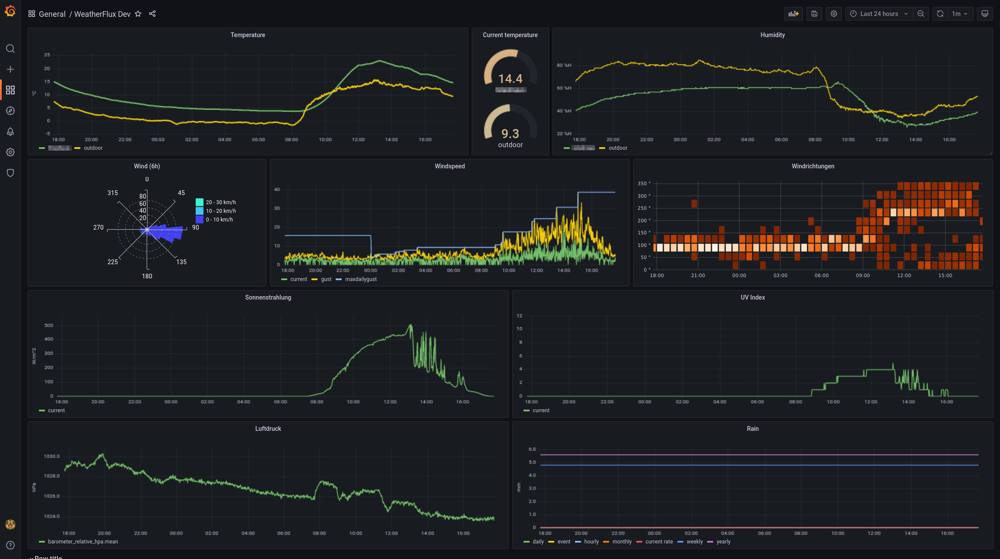

# JWeatherFlux

A docker setup for monitoring weather data from a Froggit HP1000SE PRO Ultrasonic.

It acts as "custom" server, ingests data into an Influx database and visualizes
it with Grafana.

Additionally, you can forward the data to other weather networks. Currently
there are forwarders for WeatherUnderground, Awekas and wetter.com.

Use it at your own risk! No warranty at all is provided!

## Prepare

Setup influxdb and grafana initially (will cause an error in grafana)

    cd docker
    docker-compose up

(If the docker setup cannot start, because the `jweatherflux` container is still missing,
just comment it out in `docker-compose.yml`)

Since Grafana cannot work out of the box with Influx2 buckets, which don't belong
to an Influx (v1) database, you can to connect the bucket manually to the databae:

Login into Influxdb (destination host, port 8086, user `admin` with pw `admin4weather`),
retrieve the bucket ID for the bucket `weather`

Then, login into the docker container with

    sudo docker exec -it influxdb /bin/bash

When `influx v1 dbrp list` is empty, execute the following command (for the
example, that the bucket id is `b818873a0c723c6b`):

    influx v1 dbrp create --db weather -rp 0 --bucket-id b818873a0c723c6b --default
    exit

Stop and restart the containers:

    docker-compose down
    docker-compose up

Now, hopefully, Grafana will be able to execute the queries against
InfluxDB v1

## Build the java image

Create the docker container `jweatherflux` with the follwing command:

    mvn -s .mvn/settings.xml spring-boot:build-image -Dspring-boot.build-image.imageName=jweatherflux

## Deploy

    docker save -o /tmp/jweatherflux.tar jweatherflux
    scp /tmp/jweatherflux.tar you@targethost:/tmp
    ssh you@targethost
    cd ~/jweatherflux/docker
    docker-compose stop
    docker load -i /tmp/jweatherflux.tar
    docker-compose up -d

If you want, you can read the logs with

    docker logs -f docker_jweatherflux_1